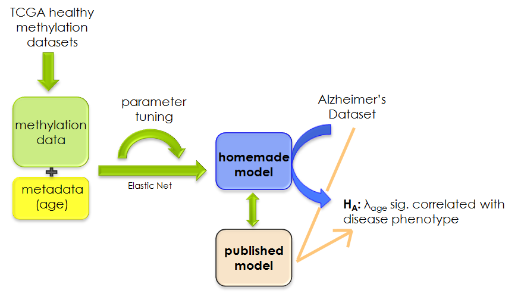
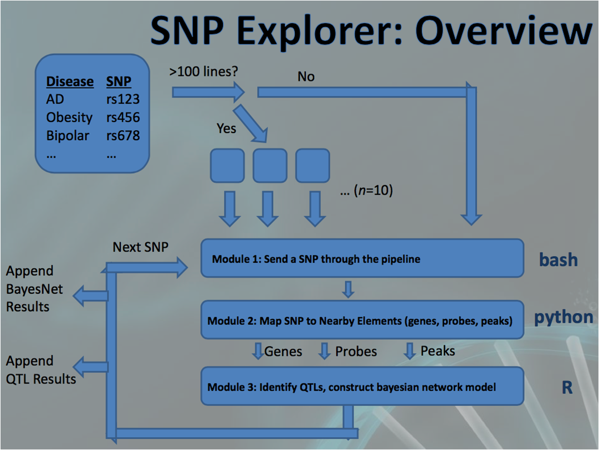
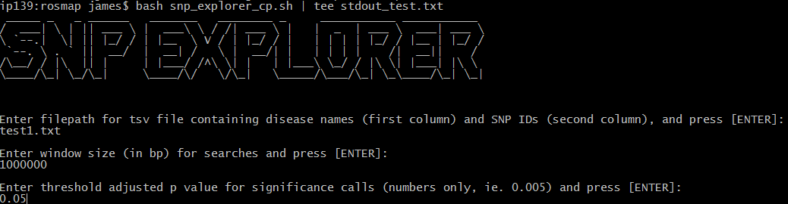

---
output:
  html_document:
    keep_md: yes
---

# James Topham
# Mostafavi Lab Rotation
# April - September, 2015
# jtopham@bcgsc.ca
# jtopham@sfu.ca

<br>

---

<br>


## **Brief Walkthrough of Filesystem Organization**

### ```Desktop/jtopham_prj```

* slides
    - contains .ppt and .pdf files for slides used during weekly lab meetings.
  - log
    - contains the lab notebook RMD file, which contains notes / bash code from each day.
  - reports
    - stopped being utilized after a few weeks, but has a couple .RMD reports on mAGE and initial exploration of bayesNet R packages
  - figures
    - contains .png and .pdf files for all figures generated in R
  - data
    - rosmap - contains data used in ROSMAP project
    - mAGE - contains data used in mAGE project
  - scripts
    - rosmap - ROSMAP project scripts (pl, py, R, sh)
    - mAGE - contains mAGE project R script (entire project)
  - results
    - this contains .tsv results from the SNP Explorer analyses done on Aug 19, 21 and 26th
  - github
    - this contains a complete and organized copy of the github repository

<br>

# **DNA-methylation and Age (mAGE) Project**

<br>

The aim of this project was to build an elastic net linear regression model (using *glmnet* package in R) to predict a persons age based on their methylation data. The idea was to build a model off of healthy patient samples, and then apply it to the ROSMAP study cohort, to determine whether age-acceleration was associated with traits associated with alzheimer's disease (such as cognitive decline). The experiment was based off of work performed by Steve Horvath, who built the original DNA mAGE model.

Training data was collected from publicly-available The Cancer Genome Atlas (TCGA) data. Chosen samples were from healthy tissue of patients who also had clinical data available (to parse their age from). After filtering samples, 723 samples were used for training, from 13 different tissue types.

Data was quantile and tissue - normalized. Cross-validation demonstrated reasonable accuracy on training data.

When applied to the ROSMAP cohort samples, predictions did not turn out as expected (most were predicted to be roughly the same age). When Horvath's model was also applied for comparison, it performed better. However, in both cases there was no detectable age-acceleration in samples.

<br>

### **Scripts**

#### ```Desktop/jtopham_prj/scripts/mAGE/Mage_model.R```
* single R script for project

### **Data**

#### ```Desktop/jtopham_prj/data/mAGE/TCGA_data/```
* each folder contains ```Clinical/``` and ```DNA_Methylation/``` subfolders, which contain the clinical and methylation files, respectively

### **Temp files of interest**

#### ```Desktop/jtopham_prj/data/mAGE/```
* mAGE_model.RData
    - homemade model (R glmnet object)
* meth_data_tissue_norm.txt
    - data matrix of tissue-normalized beta values
  
### **Experimental Design**

<br>


  
<br>

<br>

# **SNP Explorer Project**  
  
<br>

The aims of this project were to investigate the distribution of:

1.  methylation, expression and acetylation QTLs, and
2.  bayesian network model structures

for GWAS SNPs across multiple traits, using the methylation, acetylation, genotype and expression brain tissue data from the ROSMAP study.

The ROSMAP methylation, acetylation and expression data was processed by removing the first ten principal components, followed by residual computation (to help remove confounding effects from ethnicity, gender, ancestry etc).

In order to identify correlated features (methylation probes, acetylation peaks and gene expression) within a some distance to a SNP, and construct bayesian network models, the SNP Explorer tool was constructed. Using this tool, QTLs were identified for 11,825 GWAS SNPs. Of these, 441 SNPs were correlated with one or more of each feature, and had a bayesian network model constructed.

Although the 346 ROSMAP patients analyzed were limited to brain tissue, QTLs detected were not limited to SNPs only associated with brain-related traits (ie. autism, schizophrenia, alzheimer's). In fact, QTLs for traits associated with tissues such as skin, colon and lung were more prevalent than those associated with brain (here we are considering the number of QTLs discovered per SNP, restricting to one QTL of each type).

In terms of the bayesian network models, models with arcs from methylation, as well as the independent model, were over-represented. However, permutation testing demonstrated that there could perhaps be a bias in the model scoring.

<br>

### **Scripts**

#### ```Desktop/jtopham_prj/scripts/rosmap/```
* SE_results_analysis.R
    - R script used to analyze QTL and bayesNet results
* snp_explorer_permutation.R
    - script used to perform permutation testing
* AD_DF_construction_PCA_residuals.R
    - script used to construct data matrices. not meant to be run all-at-once (ideally, only the genotype matrix should ever need to be modified, anyway)
* snp_grabber.py
    - python script that parses SNPs from Broad data. must be run on Broad servers
* snp_filter.pl
    - perl script used to filter the large (11GB) SNP annotation file from dbSNP
* **snp_explorer_cp.sh**
    - 'control panel' for SNP explorer. this is the interface at which the entire pipeline is ran
* **snp_explorer_m0.sh**
    - module 0: bash script that initiates pipeline (mainly used for parallelization and organizational purposes)
* **snp_explorer_m1.py**
    - module 1: python script that finds features nearby SNP within user-specified window
* **snp_explorer_m2.R**
    - module 2: R script that parses nearby elements from data matrices, finds QTLs, and constructs bayesNet models
  
### **Data**

#### ```Desktop/jtopham_prj/data/rosmap/```
* met_data_residuals.tsv
* geno_data_filtered.tsv
* acet_data_residuals.tsv
* exp_data_residuals.tsv
    - these are the .tsv files for the processed ROSMAP data

* **met_data_residuals.RData**
* **geno_data_filtered.RData**
* **acet_data_residuals.RData**
* **exp_data_residuals.RData**
    - these are the binary .RData files for the same data matrices, utilized for faster run times

* gwascatalog.txt
    - this is the file of all GWAS SNPs from NIH
* big_snp_list.txt
    - this is a list of SNPs and disease IDs filtered from the gwas catalog. this could be input into SNP Explorer to reproduce my results, as long as the genotype matrix and SNP annotation file still contain the SNPs as I left them

* **ensembl_mapper3.txt**
    - maps gene names to genomic positions
* **filtered_CpG_map.tsv**
    - maps CpG names to genomic positions
* **peakInfo.tsv**
    - maps acetylation peak names to genomic positions


#### ```Desktop/jtopham_prj/data/rosmap/snp_annotation```
* snp141.txt
    - this is the file containing all SNPs and their annotations, downloaded from dbSNP on Aug. 12th
* assayed_snps.txt
    - this is an example of a list of SNPs in the genotype data for which a SNP Explorer run is used on. this file would serve as input for ```snp_filter.pl``` if a new list of SNPs were needed to be parsed from the dbSNP mapping file (ie. the idea is to only include annotations for the SNPs that are in the genotype data, so save time when SNP Explorer indexes the annotation file to find the genomic coordinates of a SNP) 
* **annotated_SNPs_filtered.tsv**
    - this file is the output of the ```snp_filter.pl```, and is used by the SNP Explorer pipeline to map SNP IDs to genomic positions
    

### **SNP Explorer: Pipeline overview**

<br>



<br>

---

<br>


## **SNP Explorer (SE): Example**

<br>

### *First, a note on files:*

<br>

#### SE requires the following files to run:
* acetylation, methylation, expression and genotype data files (.RData)
    - these are ```.RData``` files, currently located in ```/Desktop/jtopham_prj/data/rosmap/```
* files to map SNP IDs, peak, probe, and gene names to genomic positions
    - these are in ```Desktop/jtopham_prj/data/rosmap/snp_annotation``` (SNP to position) and ```Desktop/jtopham_prj/data/rosmap/``` (peak/probe/gene to position)

#### SE creates the following temp files:
* files pertaining to the input SNP list, split into 9 or 10 subset files
    - these are created by the control panel, and are deleted when all SE processes have completed
    - they are of the form ```subset_SNPs_ab (or 'ac' ,'ad', 'ae' etc).txt```
* files containing lists of features and distances-to-SNP
    - these are created by the python module, utilized by the R module and deleted afterward. as such, you will see them dynamically appear/dissapear in the directory SE is run in, as it runs
    - they are of the form ```z_ (snp ID) _peak (or 'genes' or 'probes').txt```

#### SE outputs the following files:
* SE_QTL_results.tsv
    - this is tab-delim and contains lots of results for all QTLs
* SE_BN_results.tsv
    - this is tab-delim and contains all results for bayesNet models constructed

<br>

### **Execution**

#### *SE outputs lots of info to standard output as it runs. Thus, it's a good idea to ```tee``` standard output to a file, to keep track of things such as the number of SNPs that map, average numbers of nearby elements, and proportion of error messages:*

### ``` bash snp_explorer_cp.sh | tee test_stdout.txt```


#### Upon execution, SE will ask the user for the filepath to the list of SNPs, the window size and adjusted p-value (threshold for significance in spearman correlations):


<br>



<br>

### **Notes**
* For my analysis, I used a 1mb window size and a p-value threshold of 0.05

* Running SE on ```Desktop/jtopham_prj/scripts/rosmap/test1.txt``` would be a good way to begin familiarizing with the pipeline.

* Each module of the pipeline has carefully-placed notes and instructions, which are particularly useful if you need to run a module on its own

* If you need to run SE on a new (or updated) list of SNPs, you will need to:
    - parse any SNPs that are NOT already in the genotype matrix from the Broad data, using ```Desktop/jtopham_prj/scripts/rosmap/snp_grabber.py```. Then, these parsed SNPs must be added to the genotype matrix data by small modification to ```Desktop/jtopham_prj/scripts/rosmap/AD_DF_construction_PCA_residuals.R```. Remember to save the dataframe as a .RData file. Also, when you save the R object, be sure it is named 'geno.data' in the R environment (see snp_explorer_m2.R, how data matrices are accessed after their .RData files are loaded).
    - then you will need to update the annotation file in ```Desktop/jtopham_prj/data/rosmap/snp_annotation``` using ```Desktop/jtopham_prj/data/rosmap/snp_annotation/snp_filter.pl```. Instructions can be found within the perl script itself (all you need to do is make a new ```assayed_snps.txt```, which is simply an /n-delim list of SNPs that are in the genotype matrix you're using)
    
    
### **SE will catch the following errors:**


**python module**

'Error ' + '(' + this_snp + '): unable to map SNP to position'

'Error ' + '(' + this_snp + '): no genes found within designated window'

'Error ' + '(' + this_snp + '): no methylation probes found within designated window'

'Error ' + '(' + this_snp + '): no acetylation peaks found within 1mb window'


**R module**

'Error: no nearby genes found in data matrix'

'Error: no nearby peaks found in data matrix'

'Error: no nearby probes found in data matrix'

'Error: SNP not found in genotype matrix'

'Error: genotype vector has more than 50% NA values'


<br>

## **Please feel free to email me with any questions!**
